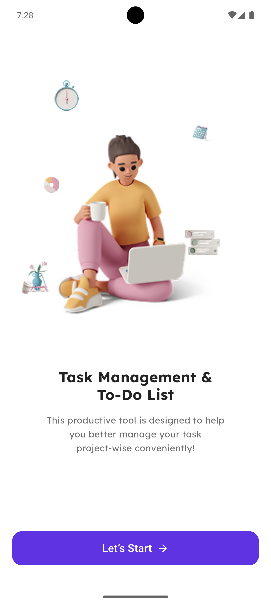
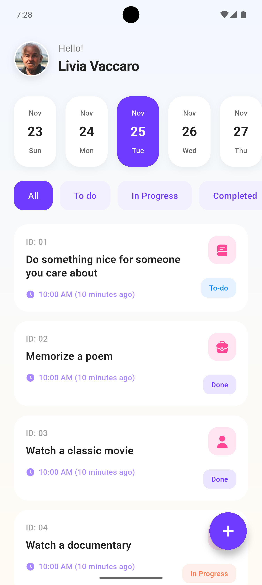
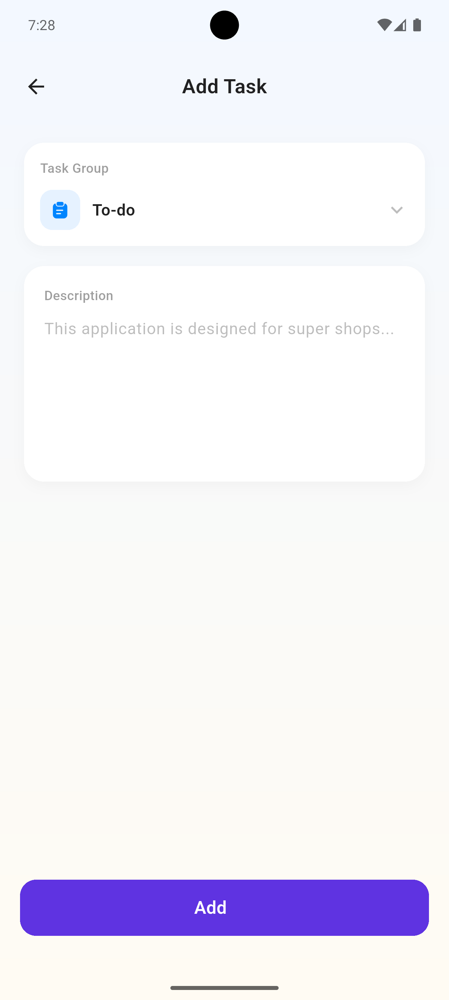
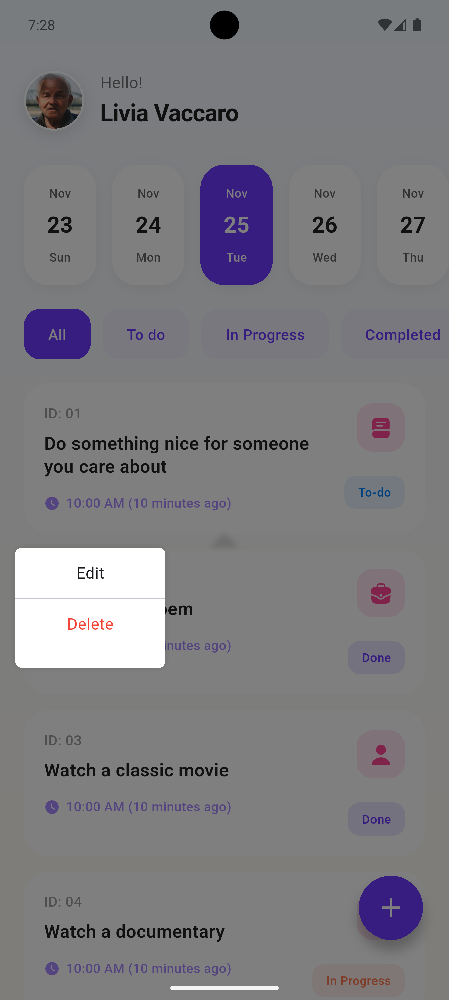

# 📝 Task Management & To-Do List

A modern, intuitive task management application built with Flutter that helps you organize your daily tasks and boost productivity.

## 🎯 About The Project

This productive tool is designed to help you better manage your tasks project-wise conveniently! The app features a clean, user-friendly interface with smooth animations and an organized workflow that makes task management effortless.

### ✨ Key Features

- **Task Organization** - Categorize tasks with different status labels (To-do, In Progress, Completed)
- **Calendar Integration** - View and manage tasks by date
- **User Profile** - Personalized dashboard with user information
- **Task Categories** - Organize tasks with icons and visual indicators
- **Real-time Updates** - See task creation time and status updates
- **Easy Task Management** - Add, edit, and delete tasks with simple gestures

## 📸 Screenshots

<div align="center">
  
  
  
</div>

<div align="center">
  
  
</div>

## 🛠️ Tech Stack

- **Framework:** Flutter
- **Language:** Dart
- **Architecture:** Clean Architecture with Provider/Riverpod pattern
- **State Management:** Provider
- **Local Storage:** For task persistence

## 📁 Project Structure

```
lib/
├── constants/         # App-wide constants
├── core/             # Core functionality and utilities
│   ├── api_client.dart
│   └── exceptions.dart
├── models/           # Data models
│   └── todo.dart
├── providers/        # State management
│   ├── theme_provider.dart
│   └── todo_provider.dart
├── repositories/     # Data repositories
│   └── todo_repository.dart
├── screens/          # UI screens
│   ├── add_todo_screen.dart
│   ├── onboarding_screen.dart
│   └── todo_list_screen.dart
├── services/         # Business logic services
│   └── todo_service.dart
├── utils/            # Utility functions
│   └── app_date_utils.dart
└── widgets/          # Reusable widgets
    ├── app_bottom_button.dart
    ├── avatar_header.dart
    ├── custom_snackbar.dart
    ├── date_chip.dart
    ├── filter_chip.dart
    ├── loading.dart
    ├── todo_card.dart
    ├── app_theme.dart
    └── main.dart
```

## 🌿 Branches

- `main` - Production-ready code
- `onboarding_screen` - Onboarding screen implementation
- `dashboard` - Main dashboard and task list features
- `add_Todo` - Task creation and editing functionality

## 🚀 Getting Started

### Prerequisites

- Flutter SDK (>=3.0.0)
- Dart SDK (>=3.0.0)
- Android Studio / VS Code
- Android/iOS emulator or physical device

### Installation

1. Clone the repository
```bash
git clone https://github.com/OnoPUNPUN/task_managment.git
```

2. Navigate to project directory
```bash
cd task_managment
```

3. Install dependencies
```bash
flutter pub get
```

4. Run the app
```bash
flutter run
```

## 📱 Features in Detail

### Onboarding Experience
- Welcoming screen with engaging 3D illustration
- Clear value proposition
- Smooth transition to main app

### Dashboard
- Calendar view for date-based task filtering
- Status filter tabs (All, To-do, In Progress, Completed)
- Task cards with icons and timestamps
- User profile section

### Task Management
- Quick task creation with categorization
- Edit existing tasks
- Delete tasks with confirmation
- Status updates with visual feedback

## 🎨 Design Highlights

- **Modern UI** - Clean, minimalist design with rounded corners
- **Vibrant Colors** - Purple accent color (#6C5CE7) for primary actions
- **Intuitive Icons** - Category-specific icons for visual organization
- **Smooth Animations** - Subtle transitions and interactions
- **Responsive Layout** - Adapts to different screen sizes

## 👤 Author

**Livia Vaccaro**

GitHub: [@OnoPUNPUN](https://github.com/OnoPUNPUN)

## 📄 License

This project is open source and available under the [MIT License](LICENSE).

## 🤝 Contributing

Contributions, issues, and feature requests are welcome! Feel free to check the [issues page](https://github.com/OnoPUNPUN/task_managment/issues).

---

<div align="center">
  Made with ❤️ using Flutter
</div>